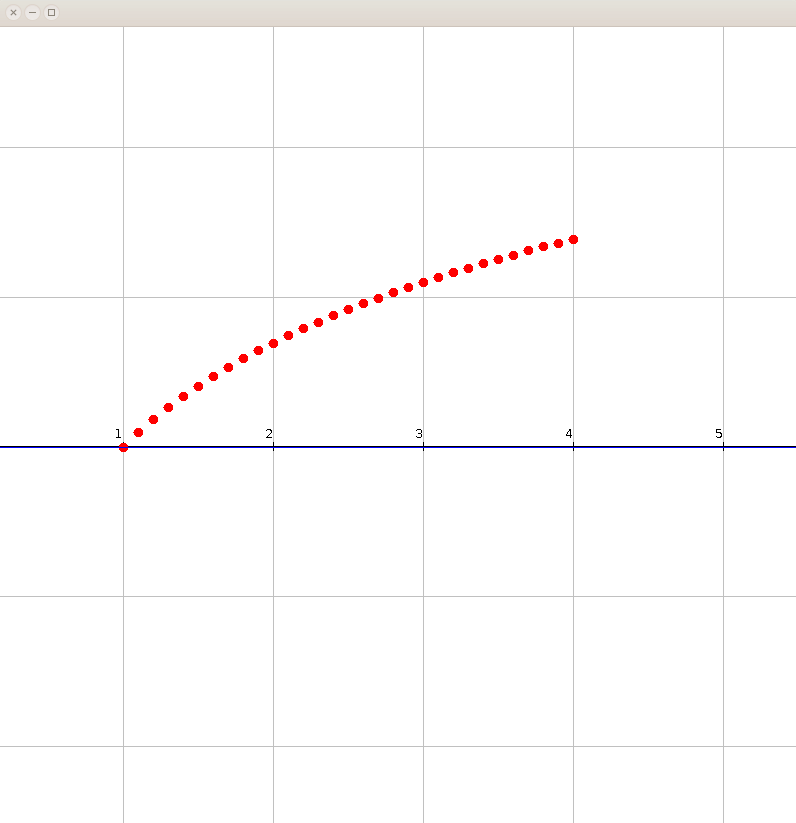

# Evolutionary-algorithms
Genericaly implemented basic evolutionary algorithms. 


This repository offers a generic implementation of basic evolutionary algorithms. 
There are two ideas behind this repository: 
* to provide a high quality simple to use implementations which can be used for experiments and
* to serve as education material for all those interested in evolutionary algorithms.

Evolutionary algorithms are a group of naturally inspired metaheuristic optimization algorithms.
This project offers implementations of the following algorithms: 
* Generation GA (genetic algorithm)
* Eliminaton GA (genetic algorithm)
* differential evolution
* NSGA (Non-Dominated Sorting Genetic Algoritm)
* CLONALG (Clonal Selection Algorithm)
* PSO (Partical swarm optimization)

## Use of the library
Since there are several different algorithms available we will not show how to use all of them, but will use the elimination genetic algorithm as a show case. 
Let's say you wish to find the minimum of the ackley function. 


In order to solve this problem you have decided to use the following strategies:
* SOLUTION REPRESENTATION: double array,
* SOLUTION QUALITY: negative of the function value, 
* CROSSING: BLXAlphaC, Discrete, WholeArithmeticRecombination
* MUTATION: NormalShiftMutation (shifts the current component value by an amount drawn from the normal distribution)
* STOPPING CONDITIONS: Function value close to 0, Number of function evaluations 

You would do this in the following way:
```java
//User provided data
int maxFunctionEvaluations = 5_000_000;
double mutationChance = 0.02;
int populationSize = 50;

//Parameters
double precision = 1e-3;
int tournamentSize = 4;
						
//Function
AckleyFunction function = new AckleyFunction();
FunctionCallCounterWrapper<double[]> wrappedFunction = new FunctionCallCounterWrapper<>(function);
		
//Variable limitations
double[] min = function.getStandardSearchMin();
double[] max = function.getStandardSearchMax();

//Decoder
IDecoder<DoubleArraySolution,double[]> decoder = new PassThroughDoubleDecoder(); 
		
//Start population generator
IStartPopulationGenerator<DoubleArraySolution> startPopulationGenerator = 
        new RandomStartPopulationGenerator(populationSize, 2, min, max);

//Evaluator
IFitnessEvaluator<DoubleArraySolution> evaluator = new NegateFitnessEvaluator<>(new FunctionValueFitnessEvaluator<>());
		
//Crossing
double alpha = 1.2;
ICrossing<DoubleArraySolution> crossing = new CompositeCrossing<DoubleArraySolution>(Arrays.asList(
				new BLXAlphaCrossing(alpha, min, max),
				new DiscreteCrossing(0.5),
				new WholeArithmeticRecombination()));
		
//Mutation
double sigm = 0.5;
IMutation<DoubleArraySolution> mutation = new NormalShiftMutation(mutationChance, sigm, min, max);
    
//Optimization stopper
IOptimisationStopper<DoubleArraySolution> evolutionStopper = new CompositeOptimisationStopper<>(Arrays.asList(
				new FunctionValueStopper<>(function.getMinValue(),precision),
				new FunctionEvaluationCountStopper<>(wrappedFunction, maxFunctionEvaluations)
		));
		
//Algorithm initialization
GeneralEliminationAlgorithm<double[],DoubleArraySolution> eliminationAlgorithm = 
				new GeneralEliminationAlgorithm<>(startPopulationGenerator, tournamentSize, crossing, mutation, decoder, wrappedFunction, evaluator, evolutionStopper);
		
//Algorithm execution
DoubleArraySolution solution = eliminationAlgorithm.run();
```
## Examples
In the examples source folder you can find several usage examples. 
All examples are divided into two groups:
* optimum detection 
* curve fitting.



